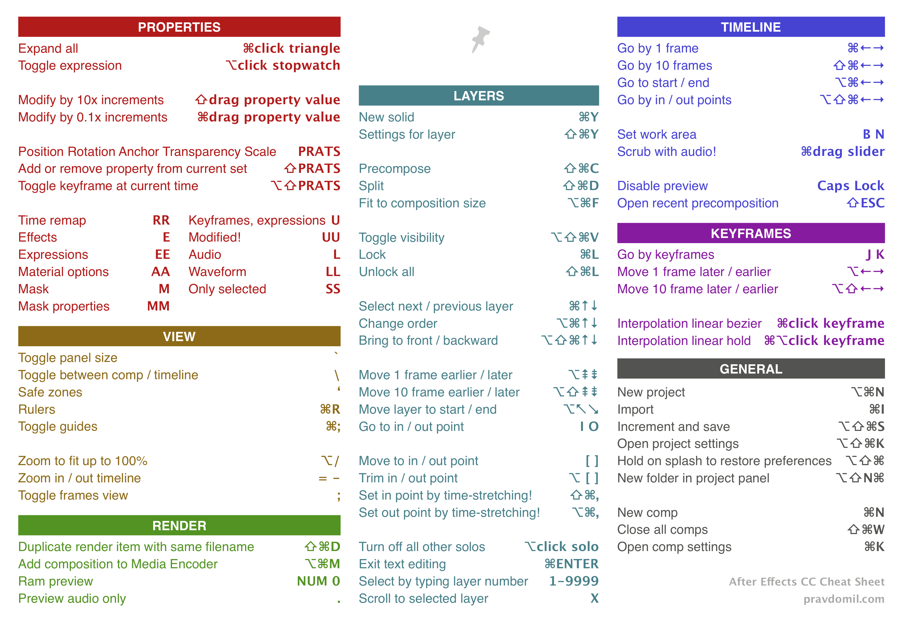

<div align="center">

# Notes

</div>


<details><summary><b>Booklet Flow</b></summary>


</details>


<details><summary><b>WordPress</b></summary>

# WordPress tips

##  Tips
- [SiteOrigin PageBuilder model](res/SiteOrigin-Page-Builder-model.pdf)
- [My official plugins](https://profiles.wordpress.org/pravdomil/#content-plugins)
- [And the rest](https://github.com/search?q=user%3Apravdomil+topic%3Awordpress-plugin)

## Little cheat sheet


</details>


<details><summary><b>Programming Tips</b></summary>

# Programming tips

## Tools
*   [Domain generator](https://www.dotomator.com/web20.html)
*   [Dead link checker](http://www.deadlinkchecker.com/)
*   [What's my DNS](https://www.whatsmydns.net)
*   [Web page test](https://www.webpagetest.org)
*   [Front‑end code quality](http://yellowlab.tools)
*   [regex101.com](https://www.regex101.com)
 
## Resources
*   [Can I use](http://caniuse.com/)
*   [HTML5.diff](https://www.w3.org/TR/html5-diff/)
*   [Command line args formatting](http://docopt.org/)
*   [Digitální strategie](http://www.vidia-design.cz/files/uploads/digitalniStrategie2015.jpg)
*   [CodeCademy](https://www.codecademy.com/learn/javascript)
*   [Csmith](http://embed.cs.utah.edu/csmith/) - proof programming languages
*   [SQL injection car](http://gizmodo.com/5498412/sql-injection-license-plate-hopes-to-foil-euro-traffic-cameras)
*   [Intro to ARM](http://www.opensecuritytraining.info/IntroARM.html)
*   [PHP error_reporting wizard](http://www.bx.com.au/tools/ultimate-php-error-reporting-wizard)
*   [Bezkontextová gramatika](https://cs.wikipedia.org/wiki/Bezkontextov%C3%A1_gramatika)
*   [Future](http://programmers.stackexchange.com/questions/119095/why-dont-we-store-the-syntax-tree-instead-of-the-source-code)
*   [C's Precedence Table](http://www.csee.umbc.edu/courses/104/fall06/burt/precedenceTable.html)
*   [Forward engineer by day, reverse engineer by night](http://withinrafael.com/)
*   [Cordic](https://cs.wikipedia.org/wiki/CORDIC)
*   [Megahertz myth](https://en.wikipedia.org/wiki/Megahertz_myth)
*   [CamelCase](https://cs.wikipedia.org/wiki/CamelCase)
*   [Never rewrite the code from scratch](http://www.joelonsoftware.com/articles/fog0000000069.html)
*   [TextMate where am I](http://ciaranwal.sh/2007/11/27/textmate-tip-where-am-i)
*   [Sequence container (C++)](https://en.wikipedia.org/wiki/Sequence_container_(C%2B%2B))
*   [Flynn's taxonomy](https://en.wikipedia.org/wiki/Flynn%27s_taxonomy)
*   [Intro to three.js](http://davidscottlyons.com/threejs/presentations/frontporch14/#slide-110)
*   [WebApps base css](https://code.google.com/p/chromium/codesearch#chromium/src/extensions/renderer/resources/platform_app.css)
*   [Snakes, Neural Networks and Genetic Algorithms](https://www.youtube.com/watch?v=BBLJFYr7zB8)

## macOS
*   [Swift introduction](http://www1.cs.columbia.edu/~aho/cs6998/Lectures/14-09-22_Roark_Swift.pdf)
*   [Swift basics](https://developer.apple.com/library/ios/documentation/Swift/Conceptual/Swift_Programming_Language/TheBasics.html)
*   [Layer Backed Views](http://www.cocoacrumbs.com/blog/?p=106)
*   [CALayer with NSScrollView](http://stackoverflow.com/questions/27442185/calayer-with-nsscrollview-zooming-panning-and-clicking/28256228)
*   [Learn Objective‑C](http://cocoadevcentral.com/d/learn_objectivec/)
*   [Apple sample codes for OS X](https://developer.apple.com/library/mac/navigation/#section=Resource%20Types&topic=Sample%20Code)
*   [Receiving and modifying key presses](http://osxbook.com/book/bonus/chapter2/alterkeys/)

## JavaScript
*   [The World's Most Misunderstood Programming Language](http://www.crockford.com/javascript/javascript.html)
*   [Coding style](https://github.com/feross/standard)
*   [ES6 features](http://es6-features.org/)
*   [ES6 Support matrix](https://kangax.github.io/compat-table/es6/)

## Node.js
*   [Reference all](https://nodejs.org/api/all.html)
*   [From PHP to Node.js](https://strongloop.com/strongblog/node-js-php-get-started/)
*   [Closure compiler](http://closure-compiler.appspot.com/home)
*   [WordPress knowledge](https://developer.files.wordpress.com/2015/11/whats-new-wpcom2.pdf)
*   [Node.js vs PHP performance](http://www.hostingadvice.com/blog/comparing-node-js-vs-php-performance/)
*   [Node.js with Apache](http://stackoverflow.com/questions/9831594/apache-and-node-js-on-the-same-server)
*   [Package.json](http://browsenpm.org/package.json)
*   [V8 Intro](https://developers.google.com/v8/)
*   [V8 Optimization tips](http://www.html5rocks.com/en/tutorials/speed/v8/)
*   [Hashbang](https://en.wikipedia.org/wiki/Shebang_(Unix))
    *   \#!/usr/bin/env node

## Frontend
*   Typography
    *   [Web typography](http://webtypography.net/toc/)
    *   [Baseline basics on Smashing magazine](http://www.smashingmagazine.com/2012/12/css-baseline-the-good-the-bad-and-the-ugly/)
    *   [Baseline framework by stephanecurzi.me](http://stephanecurzi.me/baselinecss.2009/)
    *   [Optimize legibility](http://usabilitypost.com/2012/11/06/optimize-legibility/)
*   HTML
    *   <[meter](http://www.w3schools.com/tags/tryit.asp?filename=tryhtml5_meter)> and <[progress](http://www.w3schools.com/tags/tryit.asp?filename=tryhtml5_progress)>
    *   <[input type="color"](http://www.w3schools.com/html/tryit.asp?filename=tryhtml_input_color)>
*   CSS
    *   [tabs without js](http://csscience.com/css3-tabs/)
    *   [:target selector](http://www.w3schools.com/cssref/tryit.asp?filename=trycss3_target)
    *   [Flexbox](http://learnlayout.com/flexbox.html) and [flexbox](http://css-tricks.com/snippets/css/a-guide-to-flexbox/) and [flex‑grow](http://stackoverflow.com/a/33212959/3748498)!
    *   [Full browser width bars](https://css-tricks.com/full-browser-width-bars/)
    *   [Nearest named color](http://www.yellowbearjourneys.com/color_themes/color_closest.html)
*   [Render blocking](http://www.phpied.com/css-and-the-critical-path/)
    *   [Speed insights](https://developers.google.com/speed/docs/insights/OptimizeCSSDelivery)
*   [Role of animation](https://www.youtube.com/watch?v=GxOq1bnlZXk)
*   [Polyfill.io](https://polyfill.io/v2/docs)

## Web done right
- [PageSpeed Insights Rules](https://developers.google.com/speed/docs/insights/rules)
- [Vanilla JS](http://vanilla-js.com)
- [CDN & HTTPs 2.0](https://www.cloudflare.com)

## Optional
- [Rembased design](http://rembased.pravdomil.com)
- [Pravidla typografie](https://pravidla-typografie.pravdomil.com)
- [Ochrana jednoznakovek](https://github.com/pravdomil/wp-no-orphans)

## Ubuntu server
Initial setup
```
	ssh‑copy‑id root@$IP
	ssh root@$IP
	update‑locale LC_ALL=en_US.UTF‑8 LANG=en_US.UTF‑8
	logout
	ssh root@$IP
	apt update
	apt upgrade
	reboot
```

SSH tunel  
`ssh -L LOCAL_PORT:DEST:DEST_PORT TUNEL_USER@TUNEL_SERVER -p PORT`

Create symlink  
`ln -s SOURCE SYMLINK`

</details>


<details><summary><b>macOS tip and tricks</b></summary>

# macOS tip and tricks

## Recommended settings
Inspiration goes from [kevinSuttle](https://github.com/kevinSuttle/OSXDefaults/blob/master/.osx).

- Do not use iCloud to login, you can't change login password otherwise.
- Trackpad: Use all gestures and set speed to 100%.
- Accessibility - Mouse & Trackpad: enable three finger drag.
- Sharing: Rename your Mac.
- Finder: Create folder home in user directory and use it as default one. Favorites are: Home, User, Downloads.
- Finder Preferences: Show current Mac in sidebar and show path and status bar.
- Screen Saver: set hot corners - left top: put display to sleep.
- Sound: Turn off alert volume and show volume in menu bar.
- Security & privacy: require password after 5 seconds in settings and set lock message to your telephone number.
- Parent Controls: Allow unrestricted access to websites for guest account?
- Keyboard: Turn off keyboard backlight after 1 minute and turn off smart quotes and auto correcting.
- Install [Pravdomil keyboard](https://github.com/pravdomil/keyboard#readme)

## Tips
- [How to properly use drag and drop](http://apple.stackexchange.com/questions/42429/how-to-properly-use-drag-and-drop-with-macbook-pro-on-os-x-10-7).
- [Why is Safari faster then Chrome?](https://www.youtube.com/watch?v=866eA-OnXFc)
- Use ⌥drag to set default Finder column width.

## Software
- [1Password](https://agilebits.com/downloads)
- [VLC](http://www.videolan.org/vlc/download-macosx.html)
- [Skype](http://www.skype.com/en/download-skype/skype-for-computer/) (turn off sounds)
- [VirtualBox](http://download.virtualbox.org/virtualbox/4.3.28/VirtualBox-4.3.28-100309-OSX.dmg)
- [CyberDuck](https://cyberduck.io/) (set permissions for uploaded files)
- [Keka](http://www.kekaosx.com/en/) (don't include DS_Store).
- [Retinizer](http://retinizer.mikelpr.com/)
- [GrandPerspective](http://sourceforge.net/projects/grandperspectiv/files/latest/download)
- [AppCleaner](http://www.freemacsoft.net/appcleaner/)
- [Find Any File](http://apps.tempel.org/FindAnyFile/)
- [SetResX](https://www.sendspace.com/file/mef6sk)
- [SQLite Browser](http://sqlitebrowser.org/)

</details>


<details><summary><b>Learn TypeScript</b></summary>

# Learn TypeScript

https://youtu.be/ctS2v9IBphs

```ts
//// What is TypeScript?
// ts is super set of js
// + types
// + typecheck
// + transpiler(like babel)
// + many more


//// Setup TypeScript compiler
// npm i typescript -g   # install typescript compiller
// tsc file.ts           # compile files file.ts to file.js
// tsc init              # crate package.json
// tsc -p .              # run using package.json in cwd
// tsc -p . -w           # watch mode

// use "strict": true


//// JavaScript
// two types of values
// primitives: string, number, boolean, undefined
// references: function, object

// note: class is function and class instance is object
// note: null is also object

// typescript adds: enum, type, interface
// and many more: is, in, keyof, any, never, void...


//// Variable Type Declaration
// variableName colon variableType
() => {
  // declare by type
  let trueFalse: boolean
  let bar: number
  let text: string
  
  let myArray: string[] = ["foo"]
  let tuple: [string, number, boolean] = ["bar", 1, false]
  
  function bas(myNumber: number): void {

  }
  
  // declare by value
  let active = false
  let array = [0, 1, "string"]
  
  // any
  let anyValue: any = 123 // don't use it
  
  // Type assertions
  let myValue = 1 as any as string // don't use it
}


//// ES6+ is here
() => {
  // array destructuring
  let [first, second] = [1, 2]
  let [one, ...rest] = [1, 2, 3, 4]
  let [, two, , four] = [1, 2, 3, 4]
  
  // object destructuring
  let { a, b } = { a: 1, b: 2 }
  let { c, ...passthrough } = { c: 1, d: 2 }
  let { a: newName1, b: newName2 } = { a: 1, b: 2 }
  let { e, f: newName3 = "a" } = { e: 1 };  
  
  // variable swap
  [first, second] = [second, first]
  
  // array spread
  let firstArray = [1, 2]
  let secondArray = [3, 4]
  let bothPlus = [0, ...firstArray, ...secondArray, 5]
  
  // object spread
  let defaults = { a: 1 }
  let entered = { a: 2 }
  let search = { ...defaults, ...entered }
  
  // overkill
  function f({ a, b = 0 } = { a: "" }): { a: 1 } | void {
    // ...
  }
  
  
  // more at
  // http://es6-features.org
}


//// Declaration spaces
// Value X Type X Namespace
() => {
  // class creates type and value
  class MyClass {
    
  }
  let instance: MyClass = new MyClass()
  
  
  
  // enum creates type and value
  enum MyEnum {
    value = 0
  }
  let value: MyEnum = MyEnum.value
  
  
  
  // interface creates only type
  // global scope
  interface MyInterface {
    
  }
  // let myInterface: MyInterface = MyInterface // error
  
  
  
  // type creates only type
  type MyType = {
    
  }
  // let myType: MyType = MyType // error
  
  
  
  // function creates only value
  function myFunction() {
    
  }
  // let foo: myFunction = myFunction // error
  
  
  
  // value creates only value
  let myNumber = 123
  // let foo: myNumber = myNumber // error
  
  // convert value to type
  let myNextVariable: typeof myNumber
  
  // remember: only class, enum, interface, type creates types
}


//// Types
() => {
  // String Literal Types
  function bar(color: "green" | "red") {
    // color = "white" // error
  }
  
  interface SomeInterface {
    // Class Constructor Type
    new(foo: number, bar: number): SomeInterface
    
    // Function Type
    replace(heystack: string, needle: string): string
    
    // Index Type
    [index: number]: string
    
    // this Type
    returnInstance(): this
  }
}


//// Functions
() => {
  // optional parameters
  // spread operator
  // optional return types
  // this type
  
  function foo(this: HTMLElement, arg?: number, ...rest: number[]): boolean {
    this.innerHTML
    return true
  }
  
  // anonymous
  // default value
  let anonymousFunc = (arg: number = 1): boolean => {
    return true
  }
}


//// Type alias
// creates type
() => {
  type trueFalseOrNothing = boolean | "nothing"
  let foo: trueFalseOrNothing = false
  
  type Circle = {
    radius: number,
  }
  let circle: Circle = { radius: 10 }
  
  // cannot be "extends"
}
// local scope
// let foo: trueFalseOrNothing // error


//// Interface
// creates type
// polutes entire file scope (or use namespaces)
// can be "extends"
interface Base {
  type: string
}

interface Human extends Base {
  type: "human"
  age: number
}

interface Animal extends Base {
  type: "animal"
  age: number
}

// later on I might need human's name
// declaration merging
// don't forget readonly and optional
interface Human extends Base {
  readonly name?: string
}

() => {
  function createHuman(): Human {
    return { type: "human", age: 1 } // add name
  }
  
  function updateHuman(human: Human) {
    human.age++
    // human.type = "worker" // error
  }
}
// global scope
let myAnimal: Animal


//// Enum
// similar to other languages
() => {
  // indexed members
  enum MyEnum {
    foo = 1,
    bar
  }
  
  // multiple values
  enum FileAccess {
    // constant members
    None,
    Read = 1 << 1,
    Write = 1 << 2,
    ReadWrite = Read | Write,
    // computed member
    G = "123".length
  }
  
  FileAccess.ReadWrite
  
  // string value
  enum MyEnumString {
    foo = "bar"
  }
}
// local scope
// MyEnumString.foo // error


//// Class
// can "extends" classes and "implements" types
// abstract classes
// you can define it's properties
// modifiers: public(anyone, default), private(current class), protected(current and childs)
// don't forget readonly and optional
// static variables and function
// constructor properties
() => {
  class Foo {
    
  }
  
  abstract class AnimalAbstract extends Foo implements Animal {
    type: "animal"
    age: number
  }
  // let animalAbstract = new AnimalAbstract() // error
  
  class Fish extends AnimalAbstract {
    private readonly color?: string
    
    static ocean = "Atlantic"
    
    constructor(public name: string) {
      super()
    }
    
    protected walk() {
      
    }
  }
  
  // super
  // get set
  class GoldFish extends Fish {
    walk() {
      super.walk()
    }
    
    get description() {
      return this.type + this.name
    }

    set birthDate(date: number) {
      this.age = new Date().getTime() - date
    }
  }
}
// local scope
// let myGoldFish: GoldFish


//// Union type |
// defines that value can have multiple types
() => {
  function bar(arg: string | number | HTMLElement) {
    arg
  }
  
  // used in optional arguments
  function foo(optionalArg?: string) {
    optionalArg
  }
}


//// Intersection Types &
// for extending properties
() => {
  type Loggable = { log(): void }
  
  type LoggableHuman = Human & Loggable
  
  let human = {} as LoggableHuman
  human
  
  // used in
  Object.assign
}


//// Type Guards
// ensures value type
() => {
  // using typeof
  function foo(optionalArg?: string | Function) {
    if(typeof optionalArg == "undefined") {
      optionalArg
      return
    }
    else if(typeof optionalArg == "function") {
      optionalArg
      return optionalArg
    }
    else {
      optionalArg
      return optionalArg
    }
  }
  
  // using instanceof
  function bar(arg: Event | HTMLElement) {
    if(arg instanceof HTMLElement) {
      arg
    }
    else {
      arg
    }
  }
  
  // using user defined type guard
  // check obj.type
  function isAnimal(obj: Human | Animal): obj is Animal {
    return obj.type == "animal"
  }
  
  // type never
  function myFunction(name: string) {
    if(typeof name == "string") {
      name
    }
    else {
      name
    }
  }
}


//// Namespaces
namespace Shapes {
  export namespace Polygons {
    export class Triangle { }
    export class Square { }
  }
}

new Shapes.Polygons.Triangle()

import polygons = Shapes.Polygons
let sq = new polygons.Square();


//// Generics
// you might need to pass types into functions and classes
() => {
  function loadAnimalFromServer(): Promise<Animal> {
    return new Promise((resolve) => { })
  }
  
  loadAnimalFromServer().then(animal => {
    
  })
  
  function createInstance<A extends Animal>(animalClass: new() => A): A {
    return new animalClass()
  }
}


//// Truthy
if("") { }        // false
if(NaN) { }       // false
if(undefined) { } // false
if(null) { }      // false

if({}) { }        // true
if([]) { }        // true

if(undefined == null) { } // true

if(false == "") { } // true
if(false == 0) { } // true
if(0 == "") { } // true

if(0 == null) { }         // ?


//// You don't need null
// use undefined instead
// https://github.com/Microsoft/TypeScript/wiki/Coding-guidelines#null-and-undefined


//// Modules
// same ES6 syntax
// import a from "b"
export let number = 1;
// you can import/export namespaces, types and values
// barrel: export * from "./elements/Spacer"


//// More tips
() => {
  // Make all properties in T optional
  let partial: Partial<Human> = { name: "Paul" }
  // see declaration
  
  // Make all properties in T readonly
  let readonly: Readonly<Human> = { type: "human", name: "Paul", age: 3 }
  // readonly.name = "me" // error
  // see declaration
  
  // Construct a type with a set of properties K of type T
  let record: Record<"hmm", Performance>
  // see declaration
  
  // learn about javascript call stack
  // https://www.youtube.com/watch?v=8aGhZQkoFbQ
}
```

</details>


<details><summary><b>Electronic Tips</b></summary>

# Useful tools for building electronics

- [Falstad](http://www.falstad.com/circuit/)
- [Ohm calc](http://www.elektro-energetika.cz/calculations/ohm_zak.php)
- [Led resistor calculator](http://www.hebeiltd.com.cn/?p=zz.led.resistor.calculator)
- [6 band resistor calculator](https://www.eeweb.com/toolbox/6-band-resistor-calculator/)
- [Ohm's law analogy](http://dc226.4shared.com/img/p8u2UKlcce/s24/147267bf278/ohms-law-illustrated)
- [Ohm's law chart](https://cdn.shopify.com/s/files/1/0792/1843/files/misthub-ohms-law-chart1.png)

</details>


<details><summary><b>Cheat Sheets for Adobe</b></summary>

# Cheat sheets for Adobe

## Adobe After Effects
[](res/ae/ae.pdf)

## Adobe Illustrator
[](res/ai/ai.pdf)

</details>


## Donate

Does `my notes` help you? [Donate a beer](https://www.paypal.com/cgi-bin/webscr?cmd=_s-xclick&hosted_button_id=BCL2X3AFQBAP2&item_name=help%20Beer).
